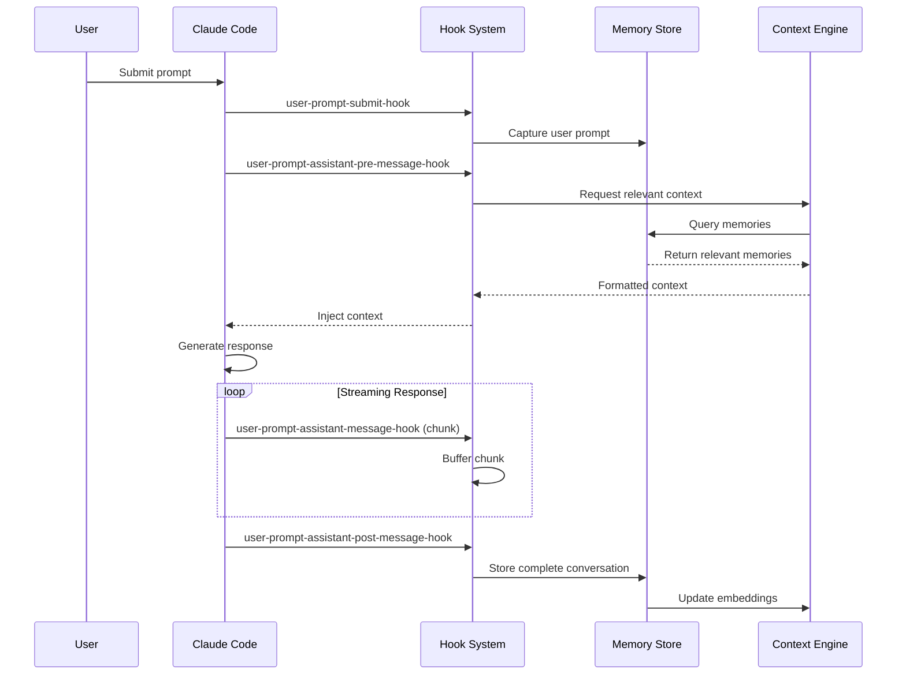

# Hook Execution Order and Data Flow

## Overview

The Claude Code Memory MCP Server integrates with Claude Code through a series of hooks that capture events at different stages of the conversation lifecycle. This document describes the execution order, data flow, and integration patterns for these hooks.

## Hook Execution Sequence

The hooks execute in a specific order during a Claude Code conversation:



## 1. User Prompt Submit Hook

**Trigger**: When a user submits a prompt to Claude Code

**Purpose**: Capture and validate user input for memory storage

**Data Flow**:
```typescript
Input: {
  type: "user-prompt-submit",
  timestamp: "2025-01-05T10:30:00Z",
  data: {
    prompt: "Help me implement a cache",
    timestamp: "2025-01-05T10:30:00Z",
    metadata: {
      source: "chat",
      filePath: "/src/cache.ts",
      lineNumber: 42
    }
  },
  context: {
    workspacePath: "/Users/dev/project",
    sessionId: "session-123",
    userId: "user-456"
  }
}

Output: {
  success: true,
  data: {
    type: "user_prompt",
    content: "Help me implement a cache",
    metadata: {
      source: "chat",
      timestamp: "2025-01-05T10:30:00Z",
      filePath: "/src/cache.ts"
    },
    capture: true,
    indexing: {
      enabled: true,
      priority: "high"
    }
  },
  metadata: {
    timestamp: "2025-01-05T10:30:00Z",
    hookId: "user-prompt-submit-hook",
    executionTime: 15,
    workspaceId: "/Users/dev/project",
    sessionId: "session-123"
  }
}
```

**Key Operations**:
- Validates prompt length and content
- Sanitizes sensitive data (API keys, passwords)
- Extracts metadata (code references, file paths)
- Determines indexing priority

## 2. User Prompt Assistant Pre-Message Hook

**Trigger**: Before Claude generates a response

**Purpose**: Inject relevant context from memory store

**Data Flow**:
```typescript
Input: {
  type: "user-prompt-assistant-pre-message",
  timestamp: "2025-01-05T10:30:01Z",
  data: {
    promptId: "prompt-789",
    userPrompt: "Help me implement a cache",
    conversationHistory: [
      { role: "user", content: "...", timestamp: "..." },
      { role: "assistant", content: "...", timestamp: "..." }
    ],
    contextRequested: true,
    maxContextTokens: 2000
  },
  context: {
    workspacePath: "/Users/dev/project",
    sessionId: "session-123"
  }
}

Output: {
  success: true,
  data: {
    inject: true,
    context: {
      relevantMemories: ["code_analysis", "previous_cache_implementations"],
      searchQueries: ["cache", "lru", "memory management"],
      maxTokens: 2000,
      priority: "high"
    },
    metadata: {
      promptId: "prompt-789",
      contextType: "code_context",
      estimatedRelevance: 0.85
    }
  },
  metadata: {
    timestamp: "2025-01-05T10:30:01Z",
    hookId: "user-prompt-assistant-pre-message-hook",
    executionTime: 50
  }
}
```

**Key Operations**:
- Analyzes prompt for context needs
- Queries memory store for relevant memories
- Builds formatted context for injection
- Manages token limits

## 3. User Prompt Assistant Message Hook

**Trigger**: During streaming of Claude's response

**Purpose**: Capture response chunks for real-time processing

**Data Flow**:
```typescript
Input: {
  type: "user-prompt-assistant-message",
  timestamp: "2025-01-05T10:30:02Z",
  data: {
    messageId: "msg-001",
    promptId: "prompt-789",
    chunk: {
      content: "I'll help you implement an LRU cache. Here's",
      index: 0,
      isFirst: true,
      isLast: false
    },
    messageType: "text"
  },
  context: {
    workspacePath: "/Users/dev/project",
    sessionId: "session-123"
  }
}

Output: {
  success: true,
  data: {
    captured: true,
    messageId: "msg-001",
    promptId: "prompt-789",
    chunkIndex: 0,
    analysis: {
      length: 45,
      type: "text",
      hasCodeBlock: false
    }
  },
  metadata: {
    timestamp: "2025-01-05T10:30:02Z",
    hookId: "user-prompt-assistant-message-hook",
    executionTime: 5
  }
}
```

**Key Operations**:
- Buffers streaming chunks
- Detects code blocks and tool usage
- Tracks file operations
- Manages memory for large responses

## 4. User Prompt Assistant Post-Message Hook

**Trigger**: After Claude completes the response

**Purpose**: Store complete conversation with analysis

**Data Flow**:
```typescript
Input: {
  type: "user-prompt-assistant-post-message",
  timestamp: "2025-01-05T10:30:10Z",
  data: {
    messageId: "msg-001",
    promptId: "prompt-789",
    userPrompt: "Help me implement a cache",
    assistantResponse: "I'll help you implement an LRU cache...[complete response]",
    metadata: {
      model: "claude-3-opus",
      tokensUsed: 1500,
      executionTime: 8000,
      toolsUsed: ["code_interpreter"],
      filesModified: ["/src/cache.ts", "/src/cache.test.ts"]
    },
    outcome: {
      success: true,
      errorCount: 0,
      warningCount: 1
    }
  },
  context: {
    workspacePath: "/Users/dev/project",
    sessionId: "session-123"
  }
}

Output: {
  success: true,
  data: {
    store: true,
    memoryEntry: {
      id: "mem-abc123",
      type: "conversation",
      timestamp: "2025-01-05T10:30:10Z",
      workspace: "/Users/dev/project",
      session: "session-123",
      content: {
        userPrompt: "Help me implement a cache",
        assistantResponse: "[complete response]",
        summary: "Implemented LRU cache with TypeScript"
      },
      artifacts: {
        tools: ["code_interpreter"],
        files: ["/src/cache.ts", "/src/cache.test.ts"],
        codeBlocks: [
          { language: "typescript", code: "..." }
        ]
      },
      tags: ["typescript", "cache", "implementation"],
      searchableText: "[optimized for search]"
    },
    indexing: {
      enabled: true,
      priority: "high",
      ttl: null
    },
    quality: {
      score: 0.85,
      factors: ["high_quality_conversation", "complete_response", "actionable_content"]
    }
  },
  metadata: {
    timestamp: "2025-01-05T10:30:10Z",
    hookId: "user-prompt-assistant-post-message-hook",
    executionTime: 75
  }
}
```

**Key Operations**:
- Creates comprehensive memory entry
- Analyzes conversation quality
- Extracts artifacts (code, files, tools)
- Generates searchable summaries
- Determines storage strategy and TTL

## Data Flow Between Hooks

### Shared Context

Each hook receives and can contribute to a shared context that flows through the execution:

```typescript
interface SharedContext {
  // Identifiers
  workspaceId: string;
  sessionId: string;
  conversationId?: string;
  promptId?: string;
  messageId?: string;
  
  // Memory references
  capturedMemories: string[];
  injectedContext: string[];
  
  // Execution metadata
  startTime: number;
  hookExecutions: Array<{
    hookId: string;
    success: boolean;
    executionTime: number;
  }>;
}
```

### Memory Correlation

Hooks correlate their data through shared identifiers:

1. **promptId**: Links user prompt to all subsequent events
2. **messageId**: Links response chunks to complete message
3. **sessionId**: Groups all events in a session
4. **workspaceId**: Isolates memories by project

## Error Handling and Recovery

### Circuit Breaker Integration

Each hook is protected by a circuit breaker:

```typescript
interface CircuitBreakerState {
  hook: string;
  state: 'closed' | 'open' | 'half-open';
  failureCount: number;
  lastFailureTime: number;
  successCount: number;
}
```

### Failure Modes

1. **Hook Timeout**: Hook exceeds execution time limit
   - Action: Skip hook, continue execution
   - Recovery: Circuit breaker handles retry

2. **Hook Error**: Hook throws exception
   - Action: Log error, return error response
   - Recovery: Fallback to default behavior

3. **Memory Store Failure**: Cannot store/retrieve memories
   - Action: Continue without memory features
   - Recovery: Queue for later processing

4. **Context Overflow**: Context exceeds token limit
   - Action: Truncate to most relevant memories
   - Recovery: Prioritize recent and high-score memories

## Performance Considerations

### Timing Constraints

| Hook | Target Latency | Max Latency | Priority |
|------|---------------|-------------|----------|
| user-prompt-submit | < 50ms | 3000ms | High |
| pre-message | < 100ms | 2000ms | Critical |
| message (per chunk) | < 10ms | 1000ms | Medium |
| post-message | < 200ms | 5000ms | Low |

### Optimization Strategies

1. **Parallel Processing**: Pre-message hook queries memories while Claude processes
2. **Chunk Buffering**: Message hook buffers chunks to reduce processing overhead
3. **Async Storage**: Post-message hook stores memories asynchronously
4. **Cache Warming**: Frequently accessed memories are pre-loaded

## Configuration

### Environment Variables

```bash
# Hook execution settings
HOOK_EXECUTION_TIMEOUT=5000
HOOK_MAX_RETRIES=3
HOOK_CIRCUIT_BREAKER_THRESHOLD=5

# Context injection settings
CONTEXT_MAX_TOKENS=2000
CONTEXT_RELEVANCE_THRESHOLD=0.5
CONTEXT_MAX_MEMORIES=10

# Memory storage settings
MEMORY_QUALITY_THRESHOLD=0.4
MEMORY_TTL_DAYS=30
MEMORY_MAX_SIZE_MB=10
```

### Hook Registry

Hooks are registered in the system configuration:

```typescript
const hookRegistry = {
  'user-prompt-submit-hook': {
    enabled: true,
    timeout: 3000,
    handler: UserPromptSubmitHook,
  },
  'user-prompt-assistant-pre-message-hook': {
    enabled: true,
    timeout: 2000,
    handler: UserPromptAssistantPreMessageHook,
  },
  'user-prompt-assistant-message-hook': {
    enabled: true,
    timeout: 1000,
    handler: UserPromptAssistantMessageHook,
  },
  'user-prompt-assistant-post-message-hook': {
    enabled: true,
    timeout: 5000,
    handler: UserPromptAssistantPostMessageHook,
  },
};
```

## Testing Hooks

### Unit Testing

Each hook should be tested in isolation:

```typescript
describe('UserPromptSubmitHook', () => {
  it('should capture valid prompts', async () => {
    const hook = new UserPromptSubmitHook();
    const event = createMockEvent('user-prompt-submit', {
      prompt: 'Test prompt',
    });
    
    const response = await hook.process(event);
    
    expect(response.success).toBe(true);
    expect(response.data.capture).toBe(true);
  });
});
```

### Integration Testing

Test the complete hook flow:

```typescript
describe('Hook Integration', () => {
  it('should process complete conversation flow', async () => {
    const system = new HookSystem();
    
    // Simulate user prompt
    await system.execute('user-prompt-submit-hook', userPromptEvent);
    
    // Simulate pre-message context injection
    await system.execute('user-prompt-assistant-pre-message-hook', preMessageEvent);
    
    // Simulate streaming response
    for (const chunk of responseChunks) {
      await system.execute('user-prompt-assistant-message-hook', chunk);
    }
    
    // Simulate post-message storage
    await system.execute('user-prompt-assistant-post-message-hook', postMessageEvent);
    
    // Verify complete flow
    expect(system.getMemories()).toHaveLength(1);
    expect(system.getContext()).toBeDefined();
  });
});
```

## Monitoring and Debugging

### Metrics to Track

1. **Hook Execution Time**: P50, P95, P99 latencies
2. **Hook Success Rate**: Successful vs failed executions
3. **Memory Operations**: Captures, retrievals, storage size
4. **Context Injection**: Size, relevance scores, hit rate
5. **Circuit Breaker**: State changes, failure patterns

### Debug Logging

Enable detailed logging for hook debugging:

```typescript
logger.debug('Hook execution started', {
  hookId: 'user-prompt-submit-hook',
  eventType: event.type,
  timestamp: event.timestamp,
  context: event.context,
});
```

### Troubleshooting Common Issues

1. **Hooks not executing**: Check circuit breaker state
2. **Missing context**: Verify memory store connectivity
3. **Slow responses**: Monitor hook execution times
4. **Memory growth**: Check buffer cleanup and TTL settings